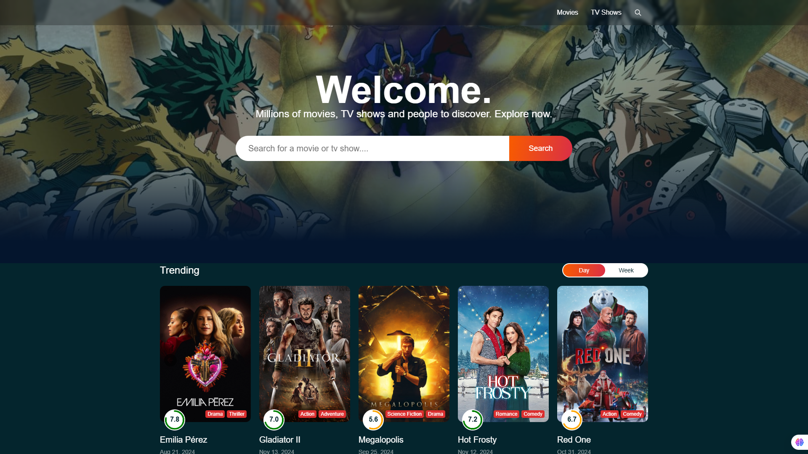
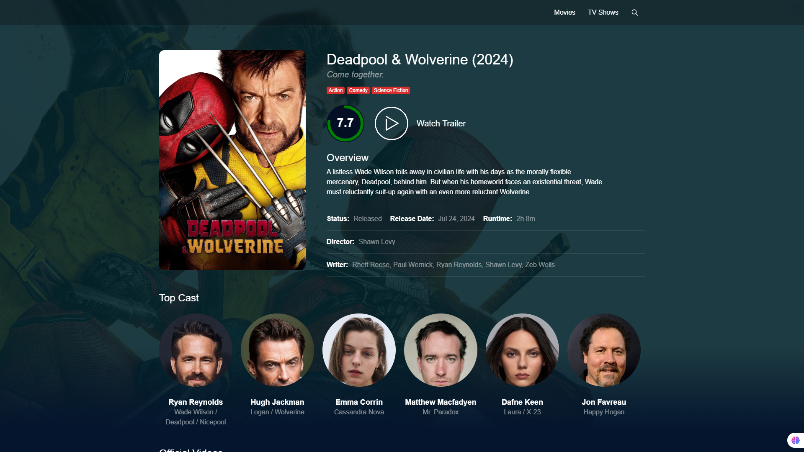
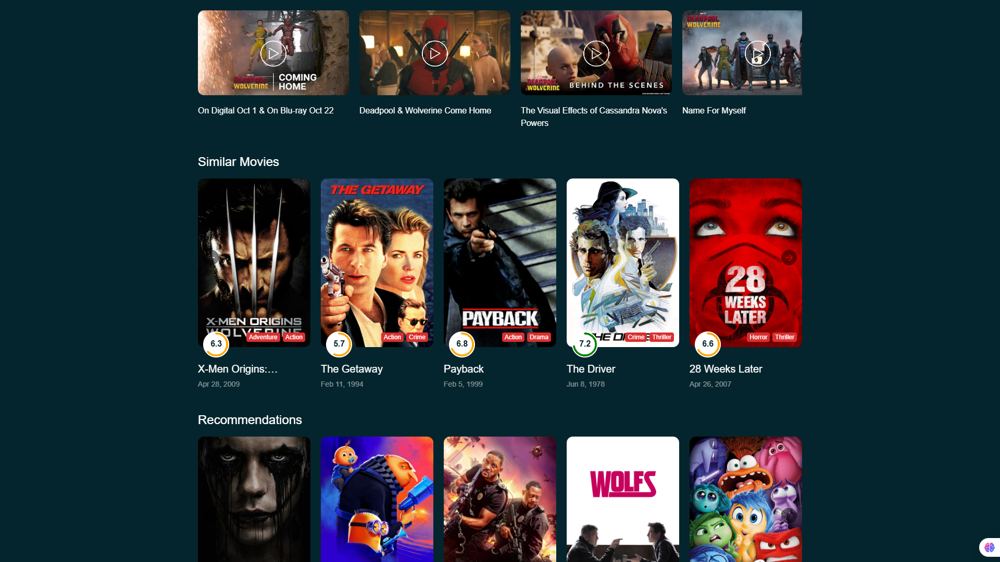

# Flixio

Flixio is my personal project to flex my React & Redux skills. It's a slick, scalable web app for movie lovers, packed with features to explore, search, and get detailed movie info – all powered by a dynamic backend!

## Features

- **Reusable React Components**: Clean, modular code.
- **Redux**: Keepin' state under control.
- **Responsive Design**: Works on every device (or we cry).
- **Dynamic Content**: Always up-to-date movie data.
- **Search Functionality**: Find your next binge-worthy show.
- **Detailed Info**: Get the 411 on every movie/show.

## Screenshots

Here’s what you’re working with:

- **Homepage**:
  

- **Movie Details**:
  

- **Movie Search**:
  

## Live Demo

Check out the live demo: [Flixio Demo](https://flixio-o.netlify.app/)

## Technologies Used

- React
- Redux
- HTML5, CSS3, JavaScript
- RESTful APIs

## Installation

To run the Flixio project locally, follow these steps:

```bash
git clone https://github.com/your-username/flixio.git
cd flixio
npm install
npm run dev
